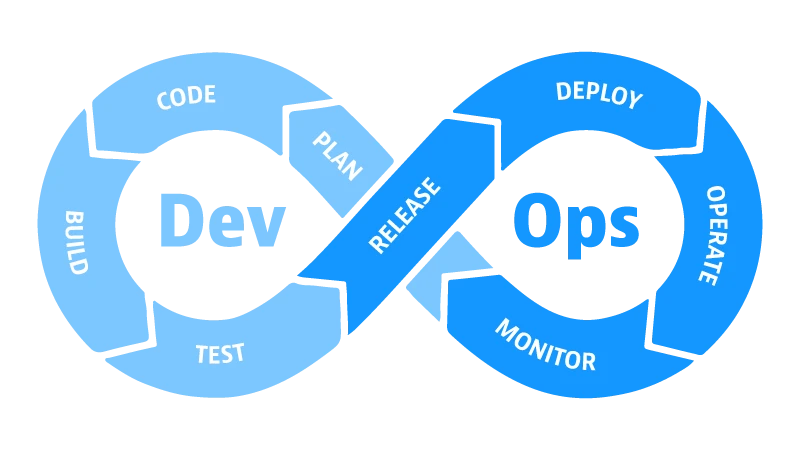

<h1 align="center">
  
</h1>

# On36 | Imersão JavaScript | Semana 10 DevOps | 2024 | 

Olá eu sou a Lili (Lilit Bandeira) e serei a professora dessa semana, numa breve apresentação eu sou Engenheira de Software no @nubank, sou ex aluna e hoje colaboro com o reprograma como professora e líder técnica.

Segue os meus contatos:

<div>
  
  <a href="https://www.linkedin.com/in/lilitbandeira"></a>
  <a href="https://www.instagram.com/lilitbandeira/"></a>
  <a href="mailto:devlilitbandeira@gmail.com"></a>
</div>

## Objetivo
* Ao término desta aula devemos compreender a Metodologia DevOps e a cultura organizacional inerente a aplicação desta metodologia e realizar deploy das nossas aplicações em produção integrando com Git Actions. 

## Plano de Aula

- [Conteúdo](#conteúdo)
    - [O que é metodologia DevOps?](#o-que-é-metodologia-devops)
    - [Quais são os princípios da metodologia DevOps?](#quais-são-os-princípios-da-metodologia-devops)
    - [Funcionamento e ciclo de vida do DevOps](#funcionamento-e-ciclo-de-vida-do-devops)
    - [Inteligência Artificial](#inteligência-artificial)
    - [Git Actions](#git-actions)
    - [Docker](#docker)
    - [AWS EC2 e S3](#aws-ec2-e-s3)
- [Prática](#prática)
- [Desafio da Semana](#desafio-da-semana)
- [Material da aula](#material-da-aula)
- [Links Úteis](#links-úteis)

## Instruções
Antes de começar, vamos organizar nosso setup.
* Fork esse repositório 
* Clone o fork na sua máquina (Para isso basta abrir o seu terminal e digitar `git clone url-do-seu-repositorio-forkado`)
* Entre na pasta do seu repositório (Para isso basta abrir o seu terminal e digitar `cd nome-do-seu-repositorio-forkado`)
<br/><br/>

# Conteúdo

## O que é metodologia DevOps?


> Uma atitude de responsabilidade compartilhada é um aspecto da cultura DevOps que incentiva uma colaboração mais estreita. É fácil para uma equipe de desenvolvimento perder o interesse na operação e manutenção de um sistema se ele for entregue a outra equipe para cuidar. Se uma equipe de desenvolvimento compartilhar a responsabilidade de cuidar de um sistema ao longo de sua vida útil, ela será capaz de compartilhar a dor da equipe de operações e, assim, identificar maneiras de simplificar a implantação e a manutenção (por exemplo, automatizando as implantações e melhorando o registro). Fragmento retirado [daqui](https://martinfowler.com/bliki/DevOpsCulture.html)

A metodologia DevOps (Development+Operations) é uma abordagem colaborativa e cultural para o desenvolvimento de software que visa integrar equipes de desenvolvimento (Dev) e operações (Ops) para melhorar a colaboração, a comunicação, a eficiência e a confiabilidade ao longo do ciclo de vida de desenvolvimento de software. Essa metodologia enfatiza a automação de processos, a integração contínua (CI - continuos integration), a entrega/implantação contínua (CD - continuos delivery/deployment) e a responsabilidade compartilhada entre as equipes, com o objetivo de aumentar a velocidade de entrega, a qualidade do software e a capacidade de resposta às mudanças do mercado. Em resumo, o DevOps visa criar um ambiente no qual o desenvolvimento, o teste e a implantação de software ocorram de forma integrada e contínua, promovendo uma cultura de colaboração e feedback constante entre as equipes de desenvolvimento e operações.

## Quais são os princípios da metodologia DevOps?

Existem certas regras que controlam o modelo DevOps. Com esses princípios de DevOps, você pode avaliar se a abordagem oferecerá valor operacional ou melhorará o ciclo geral de desenvolvimento de software do seu negócio. 

DevOps é melhorar a eficiência, qualidade e resiliência do processo de desenvolvimento de software, ao mesmo tempo em que promove uma cultura de colaboração, comunicação e responsabilidade compartilhada entre equipes de desenvolvimento e operações.

1. **Maior Colaboração e Comunicação**

   Ao integrar equipes de desenvolvimento e operações, DevOps promove uma cultura de colaboração e comunicação, o que leva a uma melhor compreensão dos requisitos e expectativas de ambos os lados.

2. **Automação para reduzir erros e aumentar a produtividade**
   
   Automatizar uma parte significativa do desenvolvimento de software personalizado para um ciclo de vida mais curto e melhores entregas. Essa automação é fundamental para alcançar implantação e testes contínuos em todo o processo. Como resultado, você não encontrará erros ou bugs no sistema no momento da inicialização.

4. **Melhoria contínua para otimizar velocidade, custo e facilidade de entrega**
   
   Usando garantia de qualidade e testes automatizados enquanto implementam feedback contínuo, as equipes de cuidam desta resiliência se esforçam para oferecer produtos aprimorados e altamente utilizáveis. O teste de integração-implantação é um ciclo contínuo, colaborativo e automatizado que ajuda as equipes de DevOps a entregar projetos complexos sem erros e no prazo.

5. **Resiliência e Confiabilidade**
   
   A cultura DevOps enfatiza a automação, a monitoração e a capacidade de resposta, o que leva a sistemas mais resistentes e confiáveis que podem lidar melhor com falhas e interrupções.

6. **Ações centradas no cliente para melhorias adicionais**

   DevOps permite uma resposta mais rápida às mudanças nos requisitos do cliente ou do mercado, permitindo que as equipes iterem e adaptem seus produtos com mais facilidade.

## Funcionamento e ciclo de vida do DevOps

O funcionamento do DevOps envolve a integração de processos, ferramentas e práticas para facilitar a colaboração e a entrega contínua de software. 

Esses aspectos trabalham juntos para criar um ambiente de desenvolvimento e operações integrado, automatizado e colaborativo, que suporta a entrega rápida, confiável e de alta qualidade de software seguindo práticas contínuas que formam o ciclo de vida DevOps.


1. **Integração Contínua (CI)**:
   - Processo automatizado de integração de código desenvolvido por diferentes membros da equipe várias vezes ao dia.
   - Utiliza ferramentas como Jenkins, GitLab CI, ou {c:magenta}**GitHub Actions**{/c} para automatizar compilações, testes e análises estáticas de código.

2. **Entrega ou Implantação Contínua (CD)**:
   - Extensão da integração contínua que automatiza a implantação de código em ambientes de teste e produção de forma rápida e segura.
   - Utiliza ferramentas de automação de implantação, como Ansible, Puppet, ou {c:magenta}**Docker**{/c}, para garantir a consistência e a confiabilidade das implantações.

3. **Automação de Infraestrutura**:
   - Implementação e gestão automatizada de infraestrutura de computação (servidores, redes, armazenamento) por meio de código.
   - Utiliza ferramentas de automação de infraestrutura, como Terraform, Chef, ou {c:magenta}**AWS CloudFormation**{/c}, para provisionar e configurar recursos de forma programática.

4. **Monitoramento e Observabilidade**:
   - Coleta de métricas, registros e alertas para monitorar a saúde e o desempenho do sistema em tempo real.
   - Utiliza ferramentas de monitoramento, como Prometheus, Grafana, ou ELK Stack, para visualizar e analisar dados operacionais e de desempenho.

5. **Cultura e Colaboração**:
   - Foco na cultura organizacional de colaboração, comunicação e responsabilidade compartilhada entre equipes de desenvolvimento e operações.
   - Promove práticas ágeis, como revisões de código, pareamento e mobs, e reuniões de stand-up, para facilitar a comunicação e o compartilhamento de conhecimento.

## Git Actions

GitHub Actions é uma ferramenta de automação oferecida pelo GitHub que permite automatizar fluxos de trabalho diretamente em seu repositório GitHub. Com o GitHub Actions, você pode criar, testar e implantar seu código diretamente do seu repositório, sem precisar de ferramentas externas. Ele funciona com base em eventos, como push de código, criação de pull requests, criação de tags e muito mais.

A relação entre GitHub Actions e a metodologia DevOps está no fato de que o GitHub Actions fornece uma plataforma para automatizar os processos de desenvolvimento, teste e implantação de software. Ao automatizar esses processos, o GitHub Actions ajuda a alcançar alguns dos princípios fundamentais do DevOps, tais como:

1. **Integração Contínua (CI)**: Com GitHub Actions, você pode configurar fluxos de trabalho para realizar a integração contínua, ou seja, automatizar a construção e os testes do seu código sempre que houver uma alteração no repositório. Isso ajuda a identificar e corrigir problemas rapidamente.

2. **Entrega Contínua (CD)**: Além da CI, você pode configurar fluxos de trabalho para implantar automaticamente o código em ambientes de desenvolvimento, homologação e produção sempre que uma alteração for mesclada na branch principal ou uma nova versão for marcada com uma tag.

3. **Automação de Processos**: GitHub Actions permite automatizar não apenas processos de CI/CD, mas também qualquer tarefa repetitiva no desenvolvimento de software, como a atualização de dependências, a notificação de equipes sobre mudanças importantes e muito mais.

4. **Feedback Rápido**: Ao automatizar os testes e implantações, GitHub Actions proporciona um feedback rápido sobre a qualidade do código e as alterações realizadas, permitindo que as equipes identifiquem e resolvam problemas rapidamente.

GitHub Actions segue a metodologia DevOps ao fornecer uma plataforma flexível e poderosa para automatizar os processos de desenvolvimento de software, facilitando a integração, entrega e feedback contínuos. Isso ajuda as equipes a colaborar de forma mais eficiente, a entregar software de alta qualidade e a responder rapidamente às mudanças no ambiente de desenvolvimento.

### Existem muitas possibilidades de fluxos e ambientes que podem atender as necessidades de negócio de cada organização, segue uma sugestão de fluxo com variedades de ambientes que exemplificam como muitas empresas trabalham:

### Ambiente de Desenvolvimento (Dev):
1. **Checkout do Repositório**
2. **Instalação de Dependências**
3. **Construção**
4. **Testes**
5. **Implantação no Ambiente de Desenvolvimento**

### Ambiente de Homologação (Hom):
1. **Checkout do Repositório**
2. **Instalação de Dependências**
3. **Construção**
4. **Testes**
5. **Implantação no Ambiente de Homologação**

### Ambiente de Produção (Prod):
1. **Checkout do Repositório**
2. **Instalação de Dependências**
3. **Construção**
4. **Testes**
5. **Implantação no Ambiente de Produção**

### Ações Específicas:
- **Fluxo de Trabalho Geral**:
   - **Acionado por**: Push, Pull Request
   - **Atividades**: Construção e Testes

- **Implantação no Ambiente de Desenvolvimento**:
   - **Acionado por**: Pull Request mesclado na branch main
   - **Atividades**: Implantação no Ambiente de Desenvolvimento

- **Implantação no Ambiente de Produção**:
   - **Acionado por**: Criação de Tag com formato específico (v*)
   - **Atividades**: Implantação no Ambiente de Produção

Esta organização facilita a compreensão das etapas específicas realizadas em cada ambiente, bem como das ações especiais acionadas em determinadas situações, como mesclagem de pull requests e criação de tags para versões de produção.

Aqui está uma versão ilustrada do arquivo YAML, incorporando os cenários descritos:

```yaml
name: 🚀 Fluxo de Trabalho DevOps

on:
  pull_request:
    branches:
      - main
  pull_request_target:
    branches:
      - main

jobs:
  build-and-test:
    runs-on: ubuntu-latest
    steps:
      - name: 🛠️ Checkout do Repositório
        uses: actions/checkout@v2

      - name: 📦 Instalação de Dependências
        run: npm install

      - name: 🚀 Construção
        run: npm run build

      - name: 🧪 Testes
        run: npm test

  build-and-deploy-dev:
    runs-on: ubuntu-latest
    if: github.event_name == 'pull_request' && github.event.action == 'closed' && github.event.pull_request.merged == true && github.ref == 'refs/heads/main'
    steps:
      - name: 🛠️ Checkout do Repositório
        uses: actions/checkout@v2

      - name: 📦 Instalação de Dependências
        run: npm install

      - name: 🚀 Construção
        run: npm run build

      - name: 🚀 Implantação no Ambiente de Desenvolvimento
        run: |
          echo "Implantando no ambiente de desenvolvimento..."
          # Comandos de implantação no ambiente de desenvolvimento aqui

  build-and-deploy-homol:
    runs-on: ubuntu-latest
    if: github.event_name == 'pull_request' && github.event.action == 'opened' && github.ref == 'refs/heads/homologação'
    steps:
      - name: 🛠️ Checkout do Repositório
        uses: actions/checkout@v2

      - name: 📦 Instalação de Dependências
        run: npm install

      - name: 🚀 Construção
        run: npm run build

      - name: 🚀 Implantação no Ambiente de Homologação
        run: |
          echo "Implantando no ambiente de homologação..."
          # Comandos de implantação no ambiente de homologação aqui

  build-and-deploy-prod:
    runs-on: ubuntu-latest
    if: github.event_name == 'push' && startsWith(github.ref, 'refs/tags/v')
    steps:
      - name: 🛠️ Checkout do Repositório
        uses: actions/checkout@v2

      - name: 📦 Instalação de Dependências
        run: npm install

      - name: 🚀 Construção
        run: npm run build

      - name: 🚀 Implantação no Ambiente de Produção
        run: |
          echo "Implantando no ambiente de produção..."
          # Comandos de implantação no ambiente de produção aqui
```

Este arquivo YAML inclui diferentes cenários baseados em eventos de pull request e push. Ele constrói e testa o código em qualquer push ou pull request, implanta no ambiente de desenvolvimento quando uma PR é mesclada na branch main, no ambiente de homologação quando uma PR é aberta para a branch de homologação e no ambiente de produção quando uma tag é criada com um formato específico (v*), indicando uma versão. Essa abordagem oferece um fluxo de trabalho controlado e automatizado para os diferentes ambientes de implantação.

### Criando fluxos de trabalhos com GitActions

Para criar fluxos de trabalho com GitHub Actions, você pode seguir estes passos:

1. **Configuração do Repositório**:
   - Acesse o seu repositório no GitHub.
   - Crie um novo arquivo chamado `.github/workflows/nome_do_workflow.yml`.
   - Esse arquivo YAML conterá a definição do seu fluxo de trabalho.

2. **Definição do Fluxo de Trabalho**:
   - No arquivo YAML, defina o nome do seu fluxo de trabalho e os gatilhos que o acionarão, como push de código, criação de pull requests ou outras atividades específicas.

3. **Configuração das Etapas (Steps)**:
   - Dentro do fluxo de trabalho, defina as etapas que serão executadas.
   - Cada etapa pode consistir em uma ou mais ações (actions), que são unidades de trabalho que realizam tarefas específicas, como executar comandos, testar código, implantar aplicativos, etc.

4. **Utilização de Ações Personalizadas**:
   - Além das ações pré-definidas fornecidas pelo GitHub, você também pode usar ações personalizadas ou criar suas próprias ações para atender às necessidades específicas do seu projeto.

5. **Execução e Monitoramento do Fluxo de Trabalho**:
   - Depois de definir o fluxo de trabalho, ele será executado automaticamente sempre que os gatilhos especificados forem acionados.
   - Você pode monitorar o progresso e o resultado do fluxo de trabalho na guia "Actions" do seu repositório no GitHub.

## Inteligência Artificial

A inteligência artificial (IA) é um campo da ciência da computação que se concentra no desenvolvimento de sistemas e máquinas capazes de realizar tarefas que normalmente exigiriam inteligência humana. Essas tarefas incluem raciocínio, aprendizado, percepção, compreensão da linguagem natural, reconhecimento de padrões, tomada de decisões e muito mais.

1. **Aprendizado de Máquina (Machine Learning)**: Uma abordagem da IA na qual os sistemas são projetados para aprender e melhorar com base em dados sem serem explicitamente programados. Isso envolve o desenvolvimento de algoritmos e modelos que podem fazer previsões ou tomar decisões com base em padrões nos dados.

2. **Redes Neurais Artificiais (ANNs)**: Modelos computacionais inspirados na estrutura e funcionamento do cérebro humano. Eles são compostos por neurônios artificiais interconectados que processam informações de maneira semelhante aos neurônios biológicos.

3. **Processamento de Linguagem Natural (PLN)**: Uma área da IA focada na interação entre computadores e humanos por meio da linguagem natural. Isso envolve a compreensão, interpretação e geração de texto em linguagem humana.

4. **Visão Computacional**: O estudo e desenvolvimento de algoritmos que permitem que os computadores entendam e interpretem o conteúdo visual, como imagens e vídeos.

5. **Robótica**: O campo que combina IA, engenharia e ciências da computação para criar sistemas robóticos capazes de interagir com o ambiente físico e executar tarefas autônomas.

A IA tem aplicações em uma variedade de setores, incluindo saúde, finanças, automotivo, varejo, jogos, entretenimento e muito mais. _Seu objetivo é desenvolver sistemas que possam imitar, ampliar ou até mesmo superar as capacidades humanas em diferentes áreas de atividade._

### Metdologia Devops x Inteligência Artificial

A inteligência artificial (IA) pode contribuir significativamente com a metodologia DevOps de várias maneiras.

1. **Automatização de processos**: A IA pode ser usada para automatizar tarefas repetitivas e manuais, como compilação de código, testes e implantação. Isso acelera o ciclo de desenvolvimento e liberação de software, permitindo que as equipes se concentrem em tarefas mais complexas e de maior valor.

2. **Análise de dados e monitoramento contínuo**: Os sistemas de IA podem analisar grandes volumes de dados de logs, métricas de desempenho e outros dados de operações para identificar padrões, anomalias e tendências. Isso ajuda a detectar problemas mais rapidamente e a prever possíveis falhas antes que elas ocorram.

3. **Otimização de recursos**: A IA pode otimizar o uso de recursos, como servidores e instâncias de nuvem, alocando-os de forma mais eficiente com base nas demandas de carga de trabalho. Isso ajuda a reduzir custos e melhorar o desempenho do sistema.

4. **Testes inteligentes**: A IA pode ajudar na criação e execução de testes mais abrangentes e inteligentes, identificando áreas críticas de código para teste e adaptando os casos de teste com base em mudanças no código. Isso ajuda a garantir a qualidade do software e a reduzir o tempo necessário para realizar testes.

5. **Assistência no diagnóstico e resolução de problemas**: Sistemas de IA podem ajudar a diagnosticar e resolver problemas mais rapidamente, sugerindo soluções com base em análises de problemas semelhantes no passado. Isso ajuda a reduzir o tempo de inatividade do sistema e a melhorar a experiência do usuário.

6. **Feedback e melhoria contínua**: A IA pode fornecer insights valiosos sobre o desempenho do sistema, o feedback dos usuários e áreas de melhoria, ajudando as equipes DevOps a iterar e melhorar continuamente seus processos e produtos. Isso leva a um ciclo de desenvolvimento mais ágil e eficiente.

### Inteligência artificial (IA) com GitHub Actions

Integrar inteligência artificial (IA) com GitHub Actions pode proporcionar uma série de benefícios para fluxos de trabalho de desenvolvimento e operações, como:

1. **Automatização de tarefas repetitivas**: Você pode usar a IA para automatizar tarefas comuns, como revisão de código, geração de documentação ou até mesmo gerenciamento de problemas.

2. **Análise de código**: Incorporar IA nos seus fluxos de trabalho de GitHub Actions pode ajudar a realizar análises mais avançadas no código, identificando padrões, vulnerabilidades de segurança, ou mesmo sugerindo melhorias de desempenho.

3. **Testes inteligentes**: Você pode usar IA para melhorar seus testes automatizados, identificando áreas críticas de código para teste ou até mesmo gerando casos de teste automaticamente com base em mudanças no código.

4. **Gerenciamento de problemas e resolução de bugs**: IA pode ajudar a identificar e priorizar problemas de software, sugerindo soluções com base em análises de problemas semelhantes ou até mesmo contribuindo para a correção automatizada de bugs.

5. **Otimização de desempenho**: Incorporar IA nos fluxos de trabalho de GitHub Actions pode ajudar a otimizar o desempenho do sistema, identificando gargalos de desempenho e sugerindo melhorias de código ou configuração.

6. **Feedback e melhoria contínua**: IA pode fornecer insights valiosos sobre o desempenho do sistema e feedback dos usuários, ajudando a equipe a iterar e melhorar continuamente seus processos e produtos.

Integrar IA com GitHub Actions pode ser feito através do desenvolvimento de scripts personalizados ou usando ferramentas e serviços de IA já disponíveis que oferecem integração com o GitHub. Essa integração pode ser uma maneira poderosa de melhorar a eficiência e a qualidade dos seus fluxos de trabalho de desenvolvimento e operações.

## Docker

[Docker](https://www.docker.com/) é um conjunto de produtos de plataforma como serviço que usam virtualização de nível de sistema operacional para entregar software em pacotes chamados contêineres. ([Wiki](https://pt.wikipedia.org/wiki/Docker_(software)))

O Objetivo é acelear a maneira como desenvolvemos, executamos e entregamos aplicativos para o mundo, removendo a necessidade de configurações e gerenciamentos manuais de ambientes. 

## AWS EC2

EC2 ou Elastic Compute Cloud é o serviço de computação em nuve da Amazon e uma das partes centrais plataforma [AWS](https://aws.amazon.com/), é um serviço que possui um nível gratuito e oferece segurança , agilidade. Com ele podemos obter computadores virtuais onde podemos rodar nossas aplicações e banco de dados.

# Prática
- [Implementação guiada](/exercicios/para-sala/)

# Desafio da Semana 
- [Desafio da semana](/exercicios/para-casa/)

# Material da aula 
- [Material](/material)

<p align="center">
Desenvolvido com :purple_heart:  
</p>

